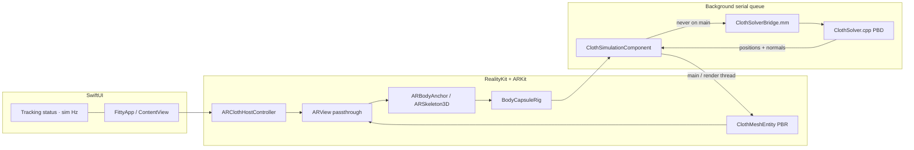

# Fitty

True-physics AR clothing fitter prototype. Capture a 3D body with ARKit, then drape a garment over it in real time with a C++ Position Based Dynamics (PBD) cloth solver.

This pass is **core scaffolding**: SwiftUI + RealityKit AR session, ARKit body tracking, an ObjC++ bridge, and a real (non-stub) PBD solver with capsule collision. There is no catalog, account system, or networking.

The project was authored on Linux and **has not been compiled on a Mac**. Open it in Xcode 16+ and build on a device.

## Architecture



**Unit system:** meters and seconds, ARKit world space (Y-up, right-handed). Joints are converted with `bodyAnchor.transform * skeleton.modelTransform(for:)` — model-space, not parent-local. Gravity is `(0, -9.81, 0)` m/s². The solver, capsules, and cloth mesh all share this frame.

**Threading:** ARKit / RealityKit produce poses on their queues. `ClothSimulationComponent` copies packed floats into preallocated buffers, then `DispatchQueue(label: "com.junholee.Fitty.pbd")` runs Verlet + constraint projection. Vertex upload hops back to the main/render thread. The C++ solver is not thread-safe and is only touched from that serial queue.

## How to open in Xcode

1. Clone `junho29800-collab/Fitty` and check out `feat/ar-cloth-scaffolding` (or merge the PR).
2. Open `Fitty.xcodeproj` in **Xcode 16 or newer** (iOS 18 SDK). Deployment target is iOS 17.0; `LowLevelMesh` is compiled behind `#available(iOS 18.0, *)`.
3. Select the **Fitty** scheme, pick a development team under Signing & Capabilities (bundle id `com.junholee.Fitty`).
4. Run on a physical iPhone or iPad. Simulator will launch a non-AR debug scene (see below).

## Device requirements

| Path | Requirement |
| --- | --- |
| Live body tracking | **A12 Bionic or newer** iPhone / iPad with a rear camera. `ARBodyTrackingConfiguration.isSupported` is checked at runtime. |
| Camera | Permission string is `NSCameraUsageDescription` in `Info.plist`. Grant camera access on first launch. |
| Simulator / unsupported hardware | App still runs. ARView switches to `.nonAR`, a standing T-pose capsule rig is spawned ~2 m along −Z, and the PBD solver drapes the garment on that hull so physics can be tested without a body. |

`UIRequiredDeviceCapabilities` lists `arm64` only (not `arkit`) so the Simulator debug path remains installable. Body tracking is a runtime feature, not a Store capability gate.

Orientations: portrait + landscape on iPhone; all four on iPad.

## Physics (what is actually implemented)

Regular **24×32** particle grid, rest spacing **1.8 cm**, particle mass 0.02 kg.

Each `step(dt)` splits into 2 substeps (dt clamped to ≤ 1/30 s) and 12 Gauss–Seidel iterations:

1. **Verlet** integrate with gravity. Velocity is implicit `(x - x_prev)`; a small damping factor bleeds energy so the sheet settles instead of ringing. Verlet is used because a hard constraint projection would fight an explicit `v` integrator.
2. **Structural** distance constraints (grid edges) — warp/weft. Stiffness 1.0. Stops the fabric growing under its own weight.
3. **Shear** constraints (cell diagonals). Stiffness 0.85. Without them a quad can flatten into a line at constant edge length.
4. **Bending** skip-one springs. Stiffness 0.35. Cheaper and more stable than dihedral constraints at this density; a lower weight lets the sheet fold rather than act like cardboard.
5. **Capsule collision.** If a dynamic particle is inside a capsule (segment + radius), it is pushed to the surface along the shortest vector. Tangential motion is damped (friction 0.35) by rewriting Verlet `prev`.
6. Kinematic **top row** follows the shoulder line every frame so the garment stays on the body as the skeleton moves.

The garment is **not** spawned on a random XY plane. `initializeGarment` places the patch from left/right shoulders and hips, offset toward the camera so it starts in front of the chest and drapes onto the capsules.

Stiffness values are classic-PBD projection weights in `[0, 1]`, not a Young's modulus. More iterations make the same weight feel more rigid.

## Project layout

```
Fitty.xcodeproj/          Xcode 16 project, C++17 + libc++, bridging header
Fitty/
  FittyApp.swift
  ContentView.swift       HUD: tracking, sim Hz, unsupported fallback
  ARViewController.swift  UIViewControllerRepresentable + AR host
  ClothSimulationComponent.swift
  BodyCapsuleRig.swift    shoulders, spine, hips, arms, legs, head
  ClothMeshEntity.swift   iOS 18 LowLevelMesh / iOS 17 MeshDescriptor
  SimulationStatus.swift
  Fitty-Bridging-Header.h
  Info.plist
  Assets.xcassets/
  Physics/
    ClothSolver.hpp / .cpp
    ClothSolverBridge.h / .mm
```

## Next steps

- Sleeve/leg meshes and pinning beyond the shoulder line.
- SDF or skinned mesh collider for chest/hip volume the capsules miss.
- XPBD compliance with a documented fabric model (N/m) instead of iteration-dependent stiffness.
- Double-buffer `LowLevelMesh.replaceUnsafeMutableBytes` if GPU/CPU hazards show up.
- Real garment assets and a catalog (out of scope for this scaffold).

## License

Private prototype. All rights reserved.
