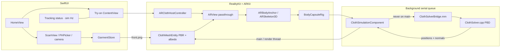

# Fitty

True-physics AR clothing fitter prototype. Scan a real garment, capture a 3D body with ARKit, then drape that photo onto a C++ Position Based Dynamics (PBD) cloth sheet in real time.

There is no catalog, account system, or networking. Physics never runs on the main thread.

The project was authored on Linux and **has not been compiled on a Mac**. Open it in Xcode 16+ and build on a device. Simulator uses PHPicker + a T-pose debug rig so scan → try-on is still exerciseable.

## Product flow

```
Home (cream canvas)
  ├─ Scan clothing  → camera viewfinder / Choose photo (PHPicker)
  │                    Vision subject lift → confirm → Documents/Garments/<uuid>/
  └─ Try on         → AR body tracking + PBD sheet textured with front.png
                      (or a woven default if nothing has been scanned yet)
```

**Home.** Wordmark, one-line subtitle, boxy primary **Scan clothing**, boxy secondary **Try on** (labelled **Try on (no scan yet)** until a garment exists — still starts the physics demo). Square thumbnail of the last scan when present.

**Scan.** Boxy camera viewfinder with a rectangular reticle. Instruction: lay the garment flat, fill the frame, front side up. Boxy shutter. Boxy **Choose photo** presents `PHPickerViewController` (images only) — this is the Simulator path. After capture, `VNGenerateForegroundInstanceMaskRequest` lifts the subject; `VNInstanceMaskObservation.generateMaskedImage(ofInstances:from:croppedToInstancesExtent:)` returns a transparent-background PNG. If lift fails, the full frame is used and the user can still confirm. Persist `Documents/Garments/<uuid>/{front.png, meta.json}`.

**Try on.** Existing AR session + PBD. `front.png` is UV-mapped onto the simulated sheet (`u` across columns, `v` shoulder → hip) via `ClothMeshEntity.applyTexture`. Optional photo-aspect scaling widens a shirt or lengthens a tunic without changing rest lengths. HUD is a cream panel at ~0.92 opacity with ink text. Boxy **Rescan**.

## Theme

`FittyTheme.swift` is the single source of truth.

| Token | RGB | Use |
| --- | --- | --- |
| canvas | (0.99, 0.96, 0.88) | cream / slight yellow |
| ink | (0.17, 0.15, 0.11) | text, 2 pt strokes |
| accent | (0.82, 0.68, 0.22) | muted gold, primary fill / reticle |
| panel | canvas @ 0.92 | HUD over AR passthrough |

Buttons: `RoundedRectangle(cornerRadius: 2)`, 2 pt ink or accent stroke. No `Capsule`, no corner radius 14+. System font, not rounded design.

## Architecture



**Unit system:** meters and seconds, ARKit world space (Y-up, right-handed). Joints are converted with `bodyAnchor.transform * skeleton.modelTransform(for:)` — model-space, not parent-local. Gravity is `(0, -9.81, 0)` m/s².

**Threading:** ARKit / RealityKit produce poses on their queues. `ClothSimulationComponent` copies packed floats into preallocated buffers, then `DispatchQueue(label: "com.junholee.Fitty.pbd")` runs Verlet + constraint projection. Vertex upload hops back to the main/render thread. Subject lifting runs on a `userInitiated` background queue. The C++ solver is not thread-safe and is only touched from the PBD serial queue.

## How to open in Xcode

1. Clone `junho29800-collab/Fitty` and check out `feat/ar-cloth-scaffolding` (or merge the PR).
2. Open `Fitty.xcodeproj` in **Xcode 16 or newer** (iOS 18 SDK). Deployment target is iOS 17.0; `LowLevelMesh` is compiled behind `#available(iOS 18.0, *)`.
3. Select the **Fitty** scheme, pick a development team under Signing & Capabilities (bundle id `com.junholee.Fitty`).
4. Run on a physical iPhone or iPad. Simulator: Home → Scan → **Choose photo** → Use this → Try on (T-pose debug hull).

## Device requirements

| Path | Requirement |
| --- | --- |
| Live body tracking | **A12 Bionic or newer** iPhone / iPad with a rear camera. `ARBodyTrackingConfiguration.isSupported` is checked at runtime. |
| Scan camera | Rear camera. `NSCameraUsageDescription` covers scanning clothing **and** body AR. |
| Photo picker | `PHPickerViewController`, images only. **No** `NSPhotoLibraryUsageDescription` — PHPicker does not need it. |
| Simulator / unsupported hardware | App still runs. Scan uses Choose photo. ARView switches to `.nonAR`, a standing T-pose capsule rig is spawned ~2 m along −Z, and the PBD solver drapes the garment on that hull. |

`UIRequiredDeviceCapabilities` lists `arm64` only (not `arkit`) so the Simulator debug path remains installable.

## Physics (what is actually implemented)

Regular **24×32** particle grid, rest spacing **1.8 cm**, particle mass 0.02 kg.

Each `step(dt)` splits into 2 substeps (dt clamped to ≤ 1/30 s) and 12 Gauss–Seidel iterations:

1. **Verlet** integrate with gravity. Velocity is implicit `(x - x_prev)`; a small damping factor bleeds energy so the sheet settles instead of ringing.
2. **Structural** distance constraints (grid edges) — warp/weft. Stiffness 1.0.
3. **Shear** constraints (cell diagonals). Stiffness 0.85.
4. **Bending** skip-one springs. Stiffness 0.35.
5. **Capsule collision.** If a dynamic particle is inside a capsule (segment + radius), it is pushed to the surface along the shortest vector. Tangential motion is damped (friction 0.35).
6. Kinematic **top row** follows the shoulder line every frame.

`initializeGarment` places the patch from left/right shoulders and hips, offset toward the camera. `setPhotoAspect(width/height)` optionally grows the patch (clamped to 1.6×) so a wide shirt is not a square. Rest lengths stay at construction spacing.

## Linux C++ tests (run, not faked)

```
g++ -std=c++17 -O2 -IFitty/Physics \
    Fitty/Physics/ClothSolver.cpp \
    Tests/ClothSolverTests.cpp \
    -o /tmp/cloth_tests
/tmp/cloth_tests
```

Last run (Debian, g++ 14.2, 2026-08-31): **20 passed, 0 failed**.

Coverage: 24×32 construct; T-pose init (shoulders ~0.4 m, hips ~0.3 m); 120 frames at 1/60 s with a standing capsule torso — no NaN/Inf, bbox extent 0.526 m (< 3 m), 741/768 particles stay above hip y=0.95, hem y ≥ 0.924; a particle planted inside a capsule is at radius after `step`; wide photo aspect grows shoulder span 0.480 m → 0.768 m without exploding.

These tests are **not** in the iOS target.

## Project layout

```
Fitty.xcodeproj/          Xcode 16 project, C++17 + libc++, bridging header
Fitty/
  FittyApp.swift          NavigationStack: Home → Scan / Try On
  FittyTheme.swift        canvas / ink / accent, boxy buttons
  HomeView.swift
  ScanView.swift
  ContentView.swift       Try-on HUD
  GarmentStore.swift      Documents/Garments/<uuid>
  GarmentIsolator.swift   Vision subject lift
  PhotoPicker.swift       PHPicker, images only
  CameraCapture.swift     AVFoundation stills
  ARViewController.swift  UIViewControllerRepresentable + AR host
  ClothSimulationComponent.swift
  BodyCapsuleRig.swift
  ClothMeshEntity.swift   applyTexture(UIImage) + LowLevelMesh / MeshDescriptor
  SimulationStatus.swift
  Fitty-Bridging-Header.h
  Info.plist
  Assets.xcassets/
  Physics/
    ClothSolver.hpp / .cpp
    ClothSolverBridge.h / .mm
Tests/
  ClothSolverTests.cpp
  README.md
```

## API risks / TODOs for a Mac pass

- `TextureResource.generate(from:withName:options:)` is the sync iOS 15+ API. Some iOS 18 pages list an `async` `generate(from:named:options:)`. If the installed SDK only exposes async, wrap in a `Task` on the main/render thread.
- RealityKit UV origin (top-left vs Metal bottom-left) may flip the albedo vertically. UVs are `v` down rows (shoulder → hip) matching photo top → bottom **if** the mesh sampler is top-left.
- `PhysicallyBasedMaterial.blending = .transparent(opacity: .init(scale:texture:))` uses the PNG alpha as opacity. If a given SDK’s `Opacity` init differs, keep `.transparent(opacity: .init(floatLiteral: 1.0))`.
- `VNGenerateForegroundInstanceMaskRequest` is iOS 17+ (WWDC23). Simulator may have weaker subject-lift models — the confirm screen still accepts the full frame.
- `MeshResource(from: LowLevelMesh)` sync vs async, `LowLevelMesh.Attribute.Semantic.uv0`, `Entity.init()` isolation — same notes as the scaffold.
- Capsules are an inner hull; chest/hip volume may still clip.
- Signing: `DEVELOPMENT_TEAM` is empty. Pick a team in Xcode.
- Classic PBD stiffness is iteration-dependent, not a Young’s modulus.

## License

Private prototype. All rights reserved.
